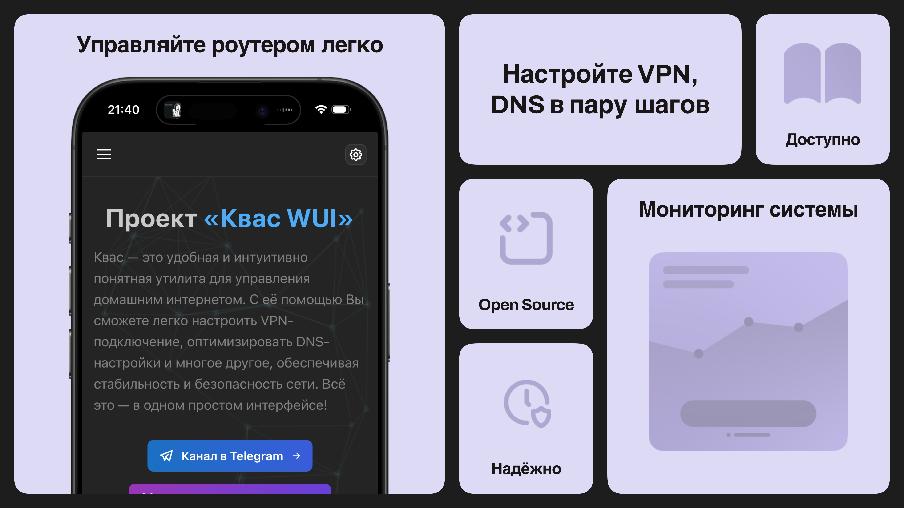

# Kvas WUI



## ⚡️ Быстрая установка для роутеров

Если хотите установить приложение **непосредственно на роутер** (без дополнительной ручной сборки фронтенда и сервера), воспользуйтесь командой ниже. В этом случае всё необходимое (бинарный файл и сборка веб-интерфейса) будет загружено и настроено **автоматически**:

```bash
curl -fsSL https://raw.githubusercontent.com/dan0102dan/kvas-wui/main/install.sh | sh
```

> **Примечание:** Если планируете разрабатывать или настраивать приложение, рекомендуем вручную собрать фронтенд и сервер по инструкции ниже. Быстрая установка предназначена в первую очередь для развёртывания готового решения на роутере.

## 🛑 Остановка и удаление утилиты

### Остановка сервиса

Чтобы остановить запущенный сервис (после быстрой установки на роутер), выполните:
```bash
/opt/etc/init.d/S99kvas-wui stop
```

### Удаление приложения

Чтобы полностью удалить приложение, выполните следующие шаги:

1. **Остановите сервис:**
   ```bash
   /opt/etc/init.d/S99kvas-wui stop
   ```
2. **Удалите установочный каталог:**
   ```bash
   rm -rf /opt/etc/kvas-wui
   ```
3. **Удалите сервисный скрипт:**
   ```bash
   rm -f /opt/etc/init.d/S99kvas-wui
   ```

После этого приложение будет полностью удалено с роутера.

## 📋 Требования для ручной сборки

### Фронтенд (React)
- **Node.js**: версия **20** или выше  
  👉 [Скачать Node.js](https://nodejs.org/)
- **npm**: устанавливается вместе с Node.js

### Сервер (Go)
- **Go**: версия **1.23** или выше  
  👉 [Скачать Go](https://golang.org/dl/)

---

## 🛠️ Установка и сборка

Этот раздел описывает полную ручную сборку и настройку — полезно для разработки или тонкой настройки проекта.

### 1. Клонирование репозитория

```bash
git clone https://github.com/dan0102dan/kvas-wui
cd kvas-wui
```

---

### 2. Сборка фронтенд‑приложения (React)

1. **Установка зависимостей:**
   ```bash
   npm install
   ```

2. **Сборка для продакшена:**
   ```bash
   npm run build
   ```
   Результат сборки будет находиться в папке `build`.

---

### 3. Сборка Go‑сервера

Перейдите в каталог с исходным кодом сервера:

```bash
cd server
```

#### Локальная сборка для текущей архитектуры

```bash
go build -o api
```

#### Сборка для различных архитектур

- **Для MIPS Little Endian (mipsel):**
  ```bash
  GOOS=linux GOARCH=mipsle go build -o api
  ```

- **Для MIPS:**
  ```bash
  GOOS=linux GOARCH=mips go build -o api
  ```

- **Для ARM64 (aarch64):**
  ```bash
  GOOS=linux GOARCH=arm64 go build -o api
  ```

---

## 🚀 Запуск проекта

### Фронтенд

Для локального запуска React-приложения (на вашем ПК) используйте:
```bash
npm start
```
Приложение будет доступно по адресу [http://localhost:3000](http://localhost:3000).

> **Примечание:** Если же вы запустили приложение **на роутере** и пытаетесь обратиться к нему с другого устройства, необходимо заменить `localhost` на IP-адрес роутера (например, `http://192.168.1.1:3000`).

### Go‑сервер

Запустите собранный бинарный файл. Например, для стандартной (локальной) сборки:
```bash
./api
```

---

## 📦 Релиз и деплой

Для автоматизации сборки и публикации релизов вы можете использовать GitHub Actions. В репозитории настроен workflow, который:
- Собирает сервер для разных архитектур (mipsel, mips, aarch64).
- Собирает React‑приложение.
- Создаёт релиз на GitHub с прикреплёнными бинарными файлами и собранным фронтендом.